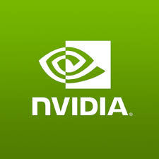

### 📊 GitHub Stats

|  |  |
| ------------- | ------------- |

### 🛠️ Languages and Tools

  <!-- Operating Systems -->
  
  
  
          
  
  <!-- Languages -->
  
  

  <!-- AL (no official icon, skipping or custom SVG needed) -->

  <!-- Container & DevOps -->
  
  
  
  
  

  <!-- Build Tools -->
  
  

  <!-- VCS -->
  

  <!-- Databases -->
  
  
  

  <!-- Monitoring -->
  
  

  <!-- IDEs -->
  
  
  

